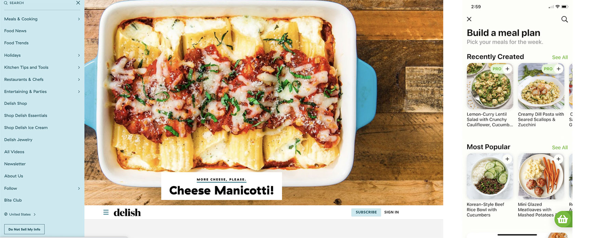
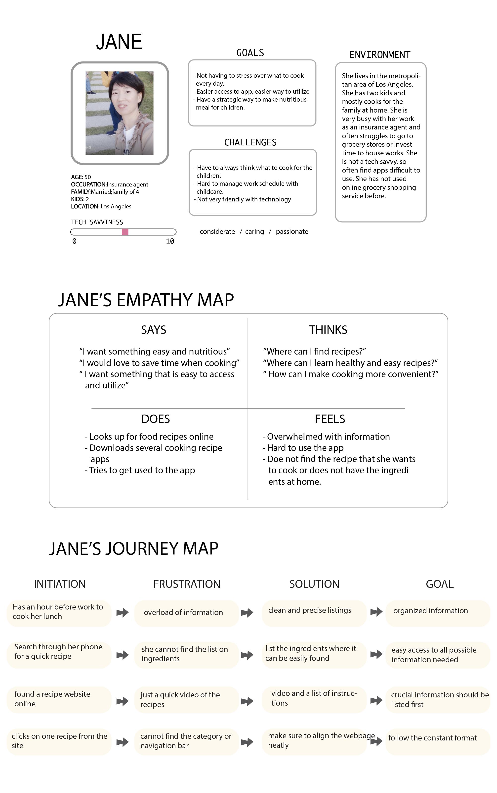
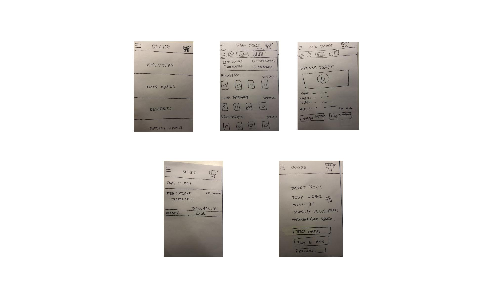
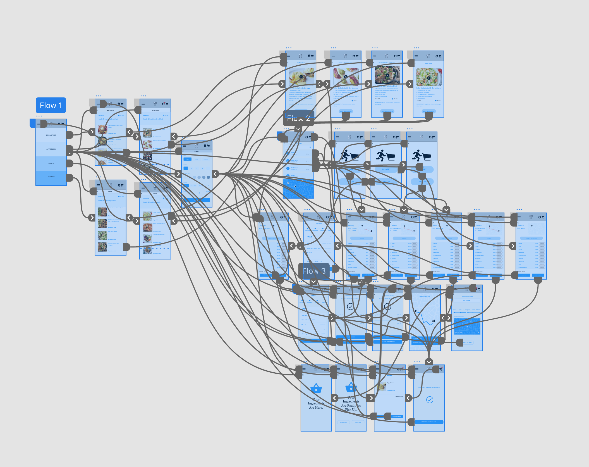
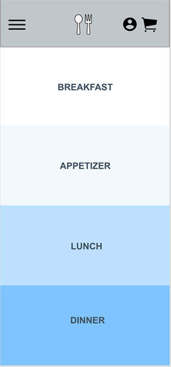
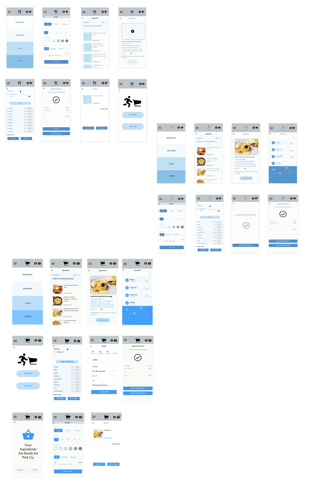

# CookCart

DH150 UX+UI by GeeYun Chae

## Introduction
CookCart is a cooking recipe app where user can easily look for a recipe and shop the ingredients that they are in the need of. During this unpleasant time, it will help individuals for their balanced meal and build interest in cooking, when the outdoor dinings are restricted. The goal of this app is to deliver convenient way for individuals to look for specific recipes, give inspirations, and safely get their ingredients by delivery or pick up option. I decided to use the name of "CookCart" by the app's multifunction in providing informative lists of cooking recipe and grocery shopping.   
[To view the full introduction](https://github.com/geeyunchae/DH150-geeyunchae)
## Design Statement
The theme of "happiness of middle-aged women" allowed me to come up with this idea. To ease the pain of having to look and think of cooking recipe during this unpleasant time, I decided to make their cooking process healthy and conveninet. CookCart is desinged to alleviate all the pains that can be found during a cooking process which one might find stressful. I hope it can help individuals to cook for balanced meals and make cooking fun by providing maximum convenience by creating most satisfying user experience. I will mostly focus on designing the app easy and approachable.   
[To view the full design statement](https://github.com/geeyunchae/Dh150-geeyunchae2). 

## Competitor analysis: Heuristic Evaluation
The design element that I put my focus was the to make the app easy to navigate. Through field research, I was able to realize that many of the users did not use the recipe website frequently becuase of their unfamiliarity when using the app or their non tech-saaviness decreases the chance to use the app. I chose one website and an app to evaluate and to find out what important factors that I need to focus in order to make the app accessible. The two competitors will be a cooking recipe website "delish" and cooking recipe app "Mealime".  
     
[To view the full heuristic evaluation](https://github.com/geeyunchae/DH150-geeyunchae)

## Competitor analysis: Usability Testing

I conducted an Usability Test on the website Delish.com. It helped to examine the app effectiveness, efficiency, and satisfaction of the website or app from the user's perspective. The test began with informed consent. For task 1, I asked the user to perform a search for "Chocolate Cake" and see how accurate the search results are. It also allowed the user to provide feedbacks for what needs to be enhanced and their satisfaction of the search results. For task 2, I asked the user to look for "halloween recipes" to test the website efficiency of user's search. It helped me to analyze how the easy the website is usable. Then, I asked the user to look for the "shopping" options on the website, which tested the flow of how easy it leads the user to make purchase. From these questions, I was able to see how easy or difficult it is to navigate through the website. From the test process, I was able to see which parts needed enhancement or development in desing and to catch the possbile mistakes that I might have made in my future development.   
https://drive.google.com/file/d/1SI4lviCJBj92LqO98RWFdtrQtUD3eAQY/view?usp=sharing

## User Research: Contextual Inquiry
This part supports users in their search of food recipes and enhancement of conveninet cooking process. The research resulted in further understanding of user's expectation toward the food recipe service. Providing a better way to find relevant and easier food recipe and options will allow many others to gain interest in cooking during this unpleasant time, when restaurant dining is prohibited or limited. This can lead many people to build up their new hobby, "cooking". Having more conveninent and handy way to find food recipes or cooking, will make cooking fun. The main element of easy usage of the app (without certain level of expertise in technology) and the following support of ingredient delivery service will relieve ease of many individual's pain having to always think and search for healthy balanced recipes.  
I chose to conduct an ethnographic research and quick-survey for the research methods.
Ethnographic research was conducted in Trader Joe's in Los Angeles ( 263 South La Brea Ave, Los Angeles, CA 90036).
The line was formed and the number of people entering the store was managed by the staff. They checked and made sure eveyone was wearing a mask and offered hand sanitizer on their entering. I observed people in the market during their shop. Everyone seemed to have their masks on, or their entrance was prohibited in the venue. I saw a lot of people wearing masks, gloves, sunglasses, or even face shields. People seemed to avoid the crowded areas or waited far from the shopper to get a product. The line was comparably longer to maintain social distancing. The cashiers were constantly sanitizing the POS and credit card readers during every encounter. After people came out from the grocety store, a number of people were sanitizing their hands from the sanitizing stations.  
[To view the full contextual inquiry](https://github.com/geeyunchae/DH150-Assignment4)

## UX Storytelling
The UX storytelling is a powerful tool that allows to shift one's perspective into the user's perspective. By storytelling, it allows the viewers to follow the persona's perspective. List of prototypes of persona, followed by the empathy map, both allows the user and the designer to have a better view of enhancing the design process. It goes into careful examination of the design to fulfill the gain, pains, and specific needs.  
Features proposed for UX design:
- Easier access throughout the web with consistency (in design/ layout)
- Efficient design to let the users do grocery shopping through the app.  
 
### Jane's Scenario  
Jnae is 50 years old and hse is mother of 2 kids. She lives in the metropolitan area of Los Angeles and works as an insurance agent. During this unpleasant time, she lacks time of working and also having to care of their children at home due to schools closing down. She mostly take cares of her lunch from take out food and struggles to take balanced meals.   

Jane feels like she spends too much money on her lunch. She decieds to pack her lunch before going to work. She does not have enough time to pack a decent lunch, so she brings her phone out and searches for a quick, easy, and healthy recipe. She opens "CookCart" and clicks on the "lunch" category. She sees lists of options, and is having hard time deciding her lunch menu. She cliks on the filter and applies the "short cooking time" and sees the quick recipes that she can make at this hour. She picks on the pasta salad for her lunch today and head to the refrigerator to see if she has all the ingredients. She has all the ingredients, but does not have lettuce. She adds the recipe in to her cart, and remove all the other ingredients that she has on the list. She moves on to delivery section and picks the closest grocery store from her home and proceeds to check out. She tracks her order and it states that it will arrive in 15 minuntes. During the wait, she prepares for other ingredients by watching the video and receives a notification of the ingredients being deliverd. She heads to the door and recieves the ingredients. She cuts the lettuce and finish her last step of preparing the dish. She made it on time and is ready to go to work without any food wastes from her cooking. She is very satisfied with her experience with CookCart and leaves the house to work.   
[To view the full Scenarios](https://github.com/geeyunchae/DH150-Assignment5)
## Low-Fidelity Prototype
The purpose of this low-fidelity prototype is to test the user interface with the prototype. The flow of the user's naviagtion along the app will test the usability and the level of utilization of the app. We will specifically focus on:  
- to begin working through how exactly the user will interact with the application.
- to learn how to use low-fidelity prototyping in the earrly stages of design.  

[To view the full low-fidelity prototype](https://github.com/geeyunchae/DH150-assignment6)
## Wireframe and Graphical Design Element Variation. 

## High-fildelity Prototype. 
    

please click on the image for the prototype   
[To view the full high-fidelity](https://github.com/geeyunchae/DH150-Assignment7)  
## Evaluation and Revision History
I reorganized the categories on the main menu from Appetizers, Main Dishes, Popular Dishes, and Desserts to Appetizers, Breakfast,Lunch, Dinner. I reorgnized the categories, so that the user's search can arrive in more satisfying results. Instead of placing the filter bar underneath the banner, I embedded the filter option into an icon on the upper left hand corner. I also added a personal notification on the right hand corner, so that the user can check their order status and updates after they place their orders. Additionally, instead of listing the ingredients on the check out page, I created a new page for the check out section to minimize confusion. Using the color contrast report was very helpful to test different fonts with background color to end up with better design with higher accessibility. From the feedbacks, I changed the fonts to more darker color and enlarged the crucial function buttons, so that it is more visible for the users. From the user personas and tasks, I mainly focused on the easy-to-use functions and to maximze the convenience of the users in different ages and aspects.  

  
[To view the full high-fidelity](https://github.com/geeyunchae/DH150-Assignment7).  

## Pitch Video

## Conclusion
What I've learned through DH150 CookCart design process:
- Check accessibility multiple of times: I learned that in order to check accessibility, it requires datas from different perspectives. I was able to collect data and testing results from different individuals to make the app more accessible. People had different understanding and habits on using the app in general. I tried to keep the consistency where people are familiar with when using the app to make it easy to use for various aged groups.
- Graphucal Interface Accessibility: Through the remote feedbacks, I was able to obtain and gather different feedbacks and comments of my prototype. It seemed clear the the color ratio test was very important for the users. Different match of the color and fonts generated different experience where it seemed more clear of confusing when using the app. It was very helpful for me to go through the design elements one more time with the comments to maxmimze the user satisfaction.
- Consistency: I leanred that consistency of the design was very important. It created more clean overall look when the fonts and design of the features were aling. I tried to arrange the functions where it seems normal to be at such as placing the cart button on the upper right hand corner of the app and using familiar icons to minimize the confusion. It seem to create smoother flow of using the app.
- Always start with low-fildelity test: I was able to learn the importance of low-fidelity prototype. It was a little confusing to actually hand-draw the app, but it helped me to test different scenarios. It proved that some on my preassumptions were incorrect and had different results from the users. During this process, it provided more clear evaluation of the parts that needed enhancement and might cause issue when developed. 
